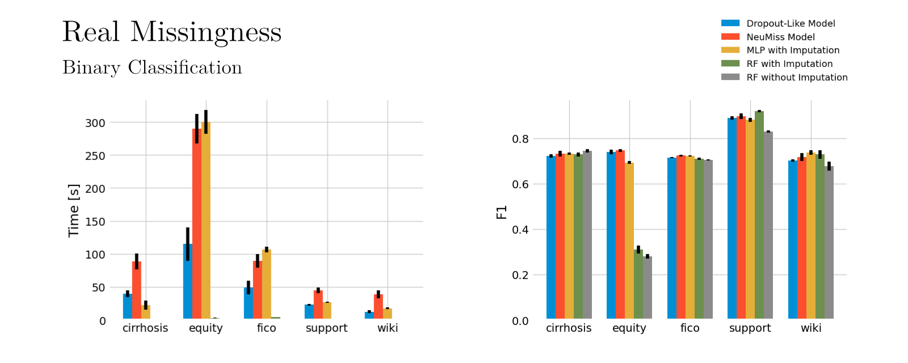

# Neural Imputations vs. Mean Imputations for Predictive Performance
 This repo holds the code for my thesis in comparing missing value imputation of specialized neural networks to simple mean imputation.

 

