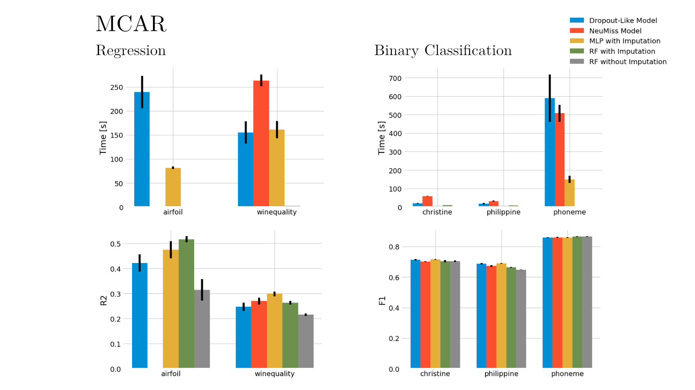
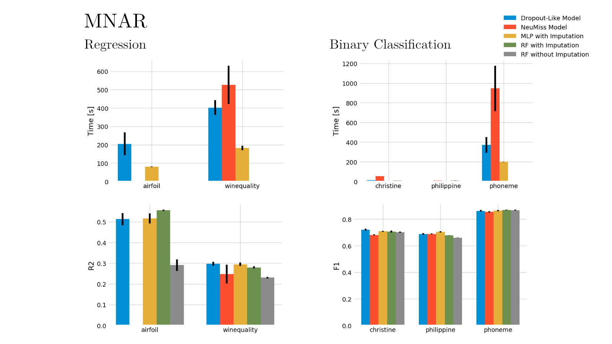

# Neural Imputations vs. Mean Imputations for Predictive Performance

This repo holds the code for my thesis in comparing missing value imputations of specialized neural networks to simple mean imputations. I perform a computational study on 10 datasets with either real missing values or with synthetically masked out missing values according to two common mechanisms: missing completely at random (MCAR) and missing not at random (MNAR).

I find that the theoretical results that suggest superiority of the neural imputations do not hold up in my experiments. The models trained with mean imputations generally perform as good if not better on the downstream predictive task as the specialized neural networks. Based on these results, imputing with mean and training a simple random forest on the imputed dataset is faster and results in same predictive performance as training a much more complicated neural network on the original un-imputed dataset.

 

